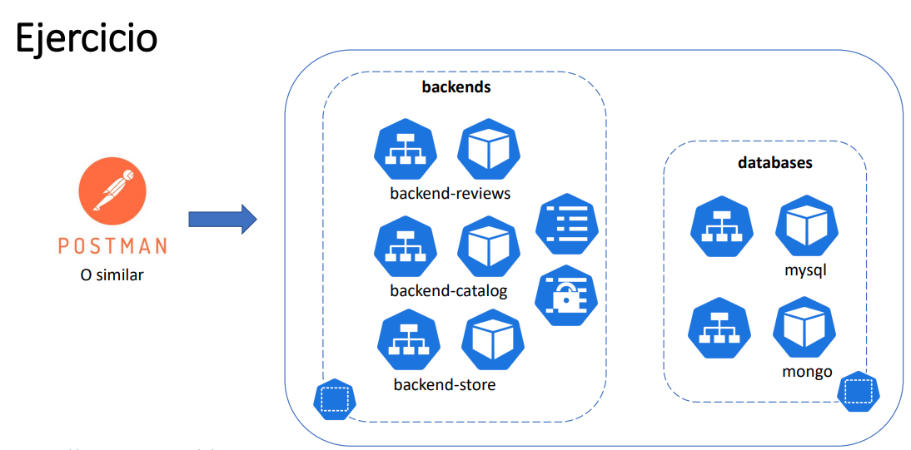

# Desplegando bookstore con namespaces
Repositorio bookstore-app: [https://github.com/chaphe/bookstore-app/tree/main/backends/persistent](https://github.com/chaphe/bookstore-app/tree/main/backends/persistent)



## Descripción del contenido del repositorio

- **backend-catalog.yaml**: configuración para el backend de catálogo.  
- **backend-reviews.yaml**:  configuración para el backend de reseñas.  
- **backend-store.yaml**: configuración para el backend de tienda.    
- **config-mongo.yaml**: configuración para el config de MongoDB.  
- **config-mysql.yaml**: configuración para el config de MySQL.  
- **mongo.yaml**: configuración para la base de datos MongoDB.  
- **multimedia**: carpeta que almacena archivos multimedia relacionados con el proyecto.  
- **mysql.yaml**: configuración para las bases de datos MySQL.  
- **package.json**: archivo de configuración de Node.js que detalla las dependencias y scripts del proyecto.
- **package-lock.json**: archivo generado por Node.js para garantizar versiones consistentes de las dependencias.   
- **reviewModel.js**: modelo de datos para gestionar las reseñas en el backend.  
- **reviews-script.js**: script de utilidad para cargar las reseñas a la base de datos de mongo.  
- **secret-mongo.yaml**: configuración para el secret de MongoDB.  
- **secret-mysql.yaml**: configuración para el secret de MySQL.  
- **store-script.sql**: script SQL para la base de datos store. 
- **catalog-script.sql**: script SQL para la base de datos catalog-library. 

## Comandos útiles

**Creación de namespaces**:
```bash
sudo microk8s kubectl create namespace [nombre-del-namespace]
```

**Creación de recursos asociados a un archivo.yaml**:
```bash
sudo microk8s kubectl apply -f [archivo.yaml] --namespace=[nombre-del-namespace]
```

**Obtener los deployments asociados a un namespace**:
```bash
sudo microk8s kubectl get deployments -n [nombre-del-namespace]
```

**Obtener los pods asociados a un namespace**:
```bash
sudo microk8s kubectl get pods -n [nombre-del-namespace]
```

**Obtener los servicios asociados a un namespace**:
```bash
sudo microk8s kubectl get services -n [nombre-del-namespace]
```

## Para comprobar cuando se clone el repositorio, lo podemos hacer con postman o desde el navegador

**Backend cátalogo**:
```text
localhost:30400/api/getlibros
```

**Backend reseñas**:
```text
localhost:30200/reviews
```
**Backend store**:
```text
localhost:30100/api/getcart?usuario=student
```

# Integrantes del grupo

- Juan Camilo Lozada Garavito 
- Daniel Camilo Barrera Pérez
- Santiago González Flores 
- Jerson Julian Cañon Castillo